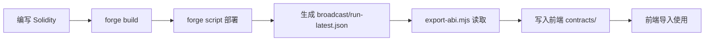

# 合约 ABI 自动同步

当合约部署完成后，自动将最新的 ABI 和合约地址同步到前端代码。

## 使用方法

### 自动同步（推荐）

运行部署脚本时会自动同步：

```bash
cd contract
./deploy.sh
```

部署脚本会自动执行以下步骤：
1. 构建合约 (`forge build`)
2. 部署合约
3. 同步 ABI 和地址到前端

### 手动同步

如果需要单独同步已部署的合约：

```bash
cd contract
node scripts/export-abi.mjs [chainId]
```

示例：
```bash
# 同步本地测试网 (默认)
node scripts/export-abi.mjs 31337

# 同步其他网络
node scripts/export-abi.mjs 11155111  # Sepolia
node scripts/export-abi.mjs 1         # Mainnet
```

## 生成文件

脚本会在前端生成以下文件：

```
dapp/src/app/contracts/
├── movieRating.ts          # MovieRating 合约配置
├── movieFanSBT.ts          # MovieFanSBT 合约配置
└── abi/                    # 原始 ABI JSON 文件
    ├── MovieRating.json
    └── MovieFanSBT.json
```

每个 TypeScript 文件包含：
- `<CONTRACT>_ADDRESS`: 合约部署地址
- `<CONTRACT>_ABI`: 合约 ABI
- `<CONTRACT>_CONTRACT`: 组合对象 (地址 + ABI)

## 生成文件示例

```typescript
// Auto-generated from contract deployment
// Generated at: 2025-11-12T06:54:32.285Z
// Chain ID: 31337
// Commit: 05544d5
// DO NOT EDIT MANUALLY - changes will be overwritten

export const MOVIE_RATING_ADDRESS = '0x5fc8d32690cc91d4c39d9d3abcbd16989f875707' as const;

export const MOVIE_RATING_ABI = [ /* ... */ ] as const;

export const MOVIE_RATING_CONTRACT = {
  address: MOVIE_RATING_ADDRESS,
  abi: MOVIE_RATING_ABI,
} as const;
```

## 前端使用

在 React 组件中导入：

```typescript
import { MOVIE_RATING_CONTRACT } from '@/app/contracts/movieRating';
import { MOVIE_FAN_S_B_T_CONTRACT } from '@/app/contracts/movieFanSBT';

// 使用 wagmi
const { data } = useReadContract({
  ...MOVIE_RATING_CONTRACT,
  functionName: 'getAverageRating',
  args: ['movie-123'],
});

// 使用 ethers
const contract = new ethers.Contract(
  MOVIE_RATING_CONTRACT.address,
  MOVIE_RATING_CONTRACT.abi,
  provider
);
```

## 多链支持

当前版本按链 ID 分别生成地址。如需在前端根据当前网络自动切换地址，可以：

### 方案 1: 环境变量

在 `.env.local` 中配置：

```bash
NEXT_PUBLIC_CHAIN_ID=31337
NEXT_PUBLIC_MOVIE_RATING_ADDRESS=0x...
```

### 方案 2: 地址映射

创建 `contracts/addresses.json`:

```json
{
  "MovieRating": {
    "31337": "0x5fc8d32690cc91d4c39d9d3abcbd16989f875707",
    "11155111": "0x..."
  },
  "MovieFanSBT": {
    "31337": "0xdc64a140aa3e981100a9beca4e685f962f0cf6c9",
    "11155111": "0x..."
  }
}
```

然后在代码中根据 `chainId` 选择地址：

```typescript
import addresses from './addresses.json';
import { MOVIE_RATING_ABI } from './movieRating';
import { useChainId } from 'wagmi';

function useMovieRatingContract() {
  const chainId = useChainId();
  return {
    address: addresses.MovieRating[chainId],
    abi: MOVIE_RATING_ABI,
  };
}
```

## 高级功能

### 集成 TypeChain（可选）

生成强类型合约接口：

```bash
# 安装依赖
pnpm add -D typechain @typechain/ethers-v6

# 生成类型
pnpm typechain --target ethers-v6 \
  --out-dir dapp/src/types/contracts \
  'contract/out/**/*.json'
```

### 自定义脚本行为

编辑 `contract/scripts/export-abi.mjs` 修改：
- 文件命名规则 (`toCamelCase`, `toConstantCase`)
- 生成路径 (`FRONTEND_CONTRACTS_DIR`)
- 输出格式（添加更多元数据）

## 故障排查

### 找不到 run-latest.json

确保先部署合约：
```bash
cd contract
forge script script/Deploy.s.sol --rpc-url <RPC_URL> --broadcast
```

### ABI 不正确

清理并重新编译：
```bash
forge clean
forge build
node scripts/export-abi.mjs
```

### 地址不匹配

检查 `broadcast/Deploy.s.sol/<chainId>/run-latest.json` 中的地址是否正确。

## 工作流程



## 注意事项

⚠️ **不要手动编辑生成的文件** - 每次部署会覆盖

✅ **建议将 `contracts/abi/` 加入 `.gitignore`** - 减少提交噪音

✅ **部署到新网络时** - 需手动整合多链地址映射
